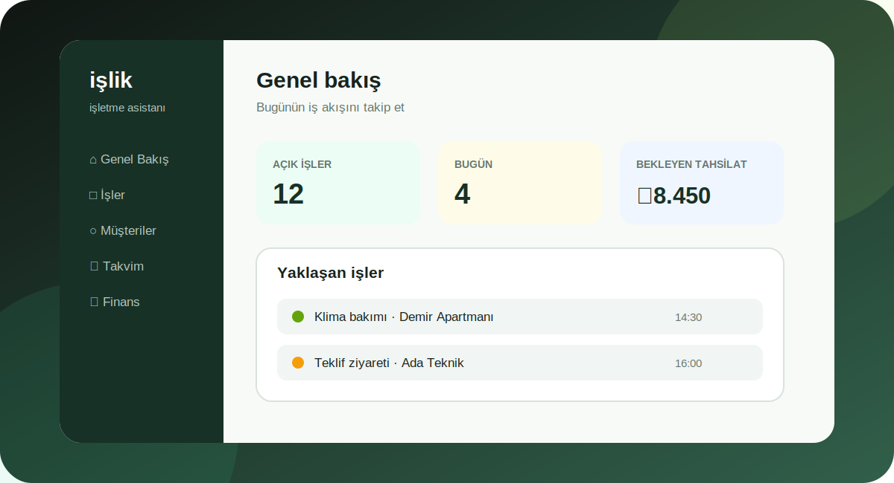

# İşlik

<p align="center">
  
</p>

Sahada çalışan küçük servis işletmelerinin işleri, müşterileri, takvimi ve tahsilatlarını tek ekranda takip etmesi için tasarlanmış; çevrimdışı destekli bir web uygulaması.

<p align="center">
  <a href="https://nurettin-erdogan.github.io/islik/"><strong>Canlı demoyu aç →</strong></a>
  &nbsp;·&nbsp;
  <a href="#veri-ve-gizlilik">Veri ve gizlilik</a>
  &nbsp;·&nbsp;
  <a href="#test">Test</a>
</p>

## Teknolojiler

- Vanilla JavaScript, HTML ve CSS
- Tarayıcı içi veri modeli ve `localStorage`
- Progressive Web App: Manifest + Service Worker
- Node.js tabanlı geliştirme sunucusu
- Yerleşik smoke testi ve GitHub Pages dağıtımı

## Öne çıkan özellikler

- İş oluşturma, düzenleme, durum değiştirme, iptal etme ve silme
- İş durumu ile ödeme durumunu ayrı takip etme
- Bugünkü ve geciken işleri filtreleme
- Müşteri geçmişini ve yaklaşan randevuları görüntüleme
- Tahsil edilen ve bekleyen ödemelerden aylık finans özeti çıkarma
- Teklif metnini kopyalama veya WhatsApp taslağı hazırlama
- Finans kayıtlarını CSV olarak dışa aktarma
- JSON yedeği indirme ve başka bir cihazda geri yükleme
- Uygulamayı telefona veya bilgisayara PWA olarak kurma

## Veri ve Gizlilik

İş ve müşteri kayıtları tarayıcının yerel depolama alanında tutulur. Sunucuya
otomatik veri gönderilmez. Tarayıcı verileri silinirse kayıtlar da silinebilir;
bu nedenle **Ayarlar > Yedeği indir** seçeneğiyle düzenli yedek alınmalıdır.

Canlı uygulama herkese açıktır, ancak her tarayıcı kendi verisini görür. Kullanıcı
hesabı, bulut eşitleme ve ekip paylaşımı bu sürümün kapsamında değildir.

## Kurulum ve yerel çalıştırma

Windows'ta `start-islik.cmd` dosyasına çift tıklayın veya terminalde:

```powershell
npm start
```

Ardından `http://127.0.0.1:4173` adresini açın.

## Test

Node.js 20.10 veya daha yeni bir sürümle:

```powershell
npm test
```

Smoke testi sunucuyu kendisi başlatır; ilk kurulum, profil, iş yönetimi, takvim,
yedek doğrulama, CSV güvenliği, mobil taşma ve çevrimdışı açılış akışlarını kontrol
eder. Masaüstü ve mobil ekran görüntüleri geçici test klasörüne kaydedilir.

## Yayınlama

`.github/workflows/pages.yml` dosyası her `main` güncellemesinde doğrulama ve
tarayıcı testlerini çalıştırır. Testler başarılı olursa uygulama GitHub Pages'a
otomatik olarak gönderilir.

## Proje Yapısı

- `index.html`: uygulamanın sayfa ve form yapısı
- `app.js`: veri modeli, ekranlar ve kullanıcı işlemleri
- `styles.css`: masaüstü ve mobil tasarım
- `sw.js`: çevrimdışı önbellek ve güncelleme davranışı
- `manifest.json`: PWA bilgileri
- `server.mjs`: yerel statik sunucu
- `tests/smoke.mjs`: uçtan uca tarayıcı testi

## Sürüm Durumu

Bu sürüm tek işletme ve tek cihaz odaklı bir MVP'dir. Sonraki ürün aşaması;
hesap sistemi, şifreli bulut yedekleme, cihazlar arası eşitleme ve rol bazlı ekip
erişimidir.
